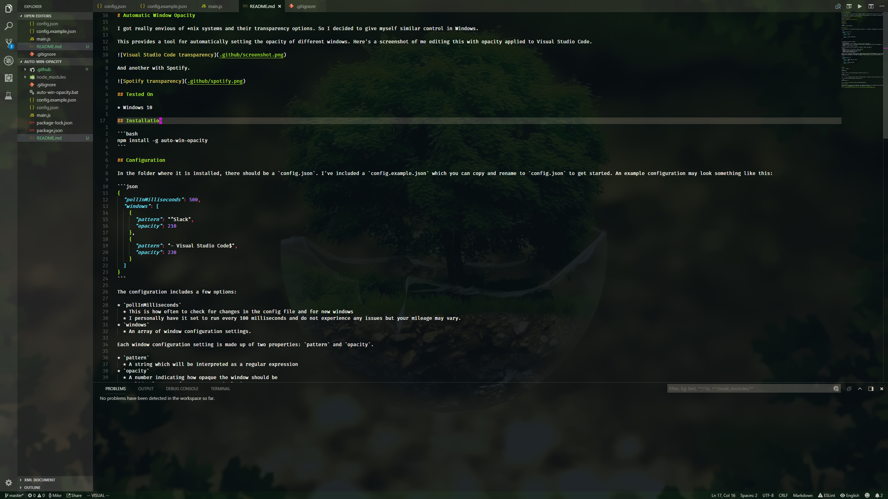

# Automatic Window Opacity

I got really envious of *nix systems and their transparency options. So I decided to give myself similar control in Windows.

This provides a tool for automatically setting the opacity of different windows. Here's a screenshot of me editing this with opacity applied to Visual Studio Code.



And another with Spotify.


## Tested On

* Windows 10

## Installation

```bash
npm install -g auto-win-opacity
```

## Configuration

In the folder where it is installed, there should be a `config.json`. I've included a `config.example.json` which you can copy and rename to `config.json` to get started. An example configuration may look something like this:

```json
{
  "pollInMilliseconds": 500,
  "windows": [
    {
      "pattern": "^Slack",
      "opacity": 210
    },
    {
      "pattern": "- Visual Studio Code$",
      "opacity": 230
    }
  ]
}
```

The configuration includes a few options:

* `pollInMilliseconds`
  * This is how often to check for changes in the config file and for new windows
  * I personally have it set to run every 100 milliseconds and do not experience any issues but your mileage may vary.
* `windows`
  * An array of window configuration settings.

Each window configuration setting is made up of two properties: `pattern` and `opacity`.

* `pattern`
  * A string which will be interpreted as a regular expression
* `opacity`
  * A number indicating how opaque the window should be
  * Valid values are from 0 to 255, inclusive
  * 0 means invisible. 255 means opaque

`pattern` is a string which will be converted into a regular expression. This will be matched against the title of the window. The system will look at every visible window and try to match the title against each pattern in order. As soon as a pattern matches, it will apply the matching opacity value and stop checking patterns. This is useful if you want to have different opacity settings for different states of a window. For example, say you wanted the GitHub homepage to appear transparent but everything else in the browser to be opaque. If you use Firefox, you could write something like this:

```json
{
  "pollInMilliseconds": 100,
  "windows": [
    {
      "pattern": "^GitHub - Mozilla Firefox$",
      "opacity": 210
    },
    {
      "pattern": "- Mozilla Firefox$",
      "opacity": 255
    }
  ]
}
```

## Usage

To start it, simply run

```bash
auto-win-opacity
```

To edit the config file, you can either open the `config.json` yourself or run

```bash
auto-win-opacity edit
```

**Note:** This will attempt to open the config in Visual Studio Code. It's my editor of choice so that's what it currently does.

If for some reason you decide it needs to stop, you can run

```bash
auto-win-opacity kill
```

This will stop the current process as soon as the polling periods ends.

## Advanced Usage

I like to have it run at startup in the background. I went ahead and included a very, very simple batch script here that you can link to in your startup folder. By default, this will make an empty command prompt window appear. There are ways of making it run in the background [which I will leave as an exercise for the reader.][1]

[1]: http://www.winhelponline.com/blog/run-bat-files-invisibly-without-displaying-command-prompt/